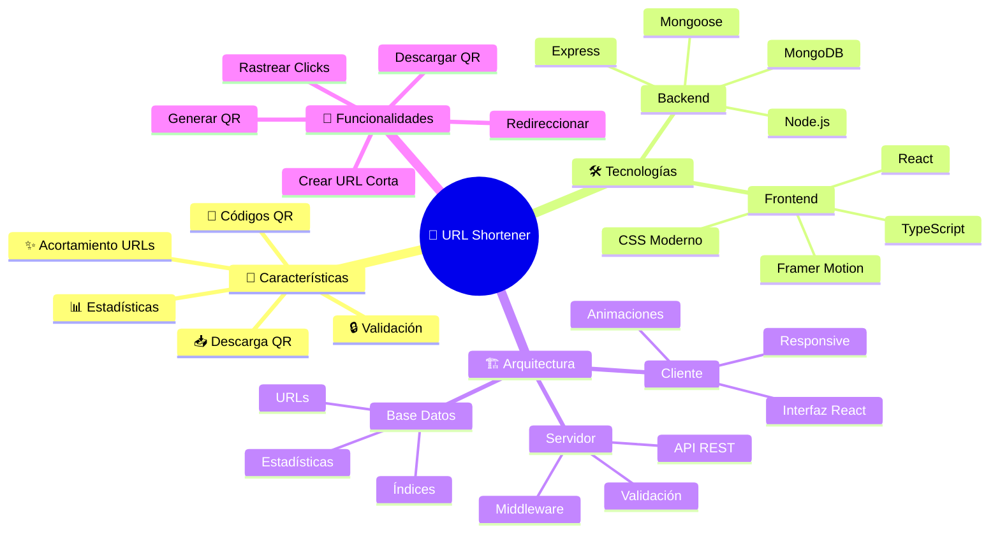
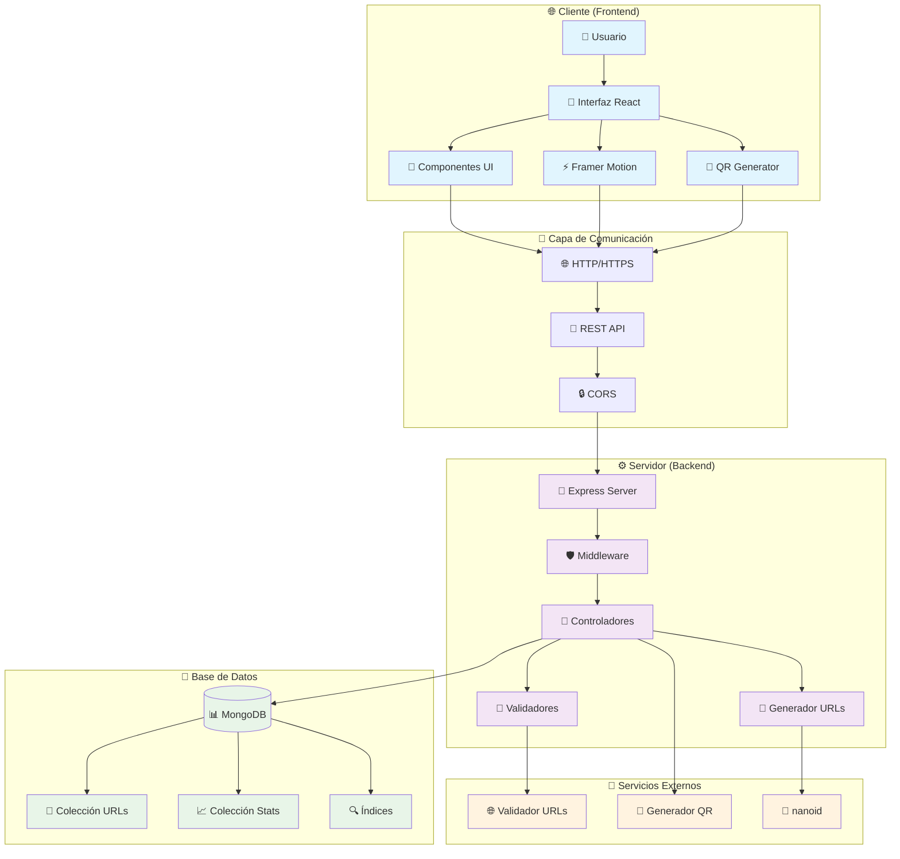
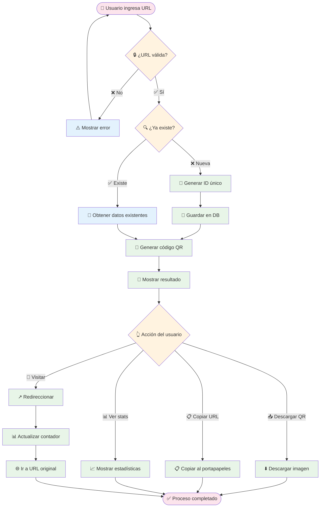
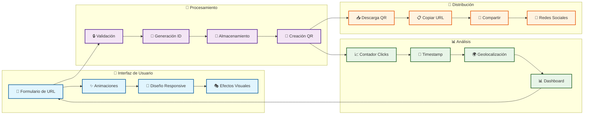
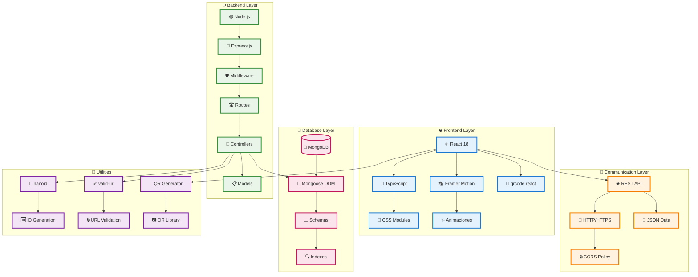
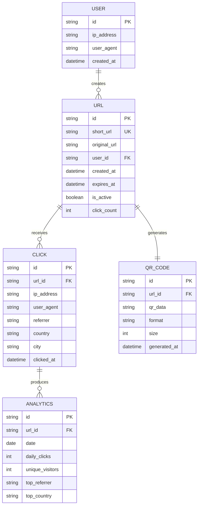
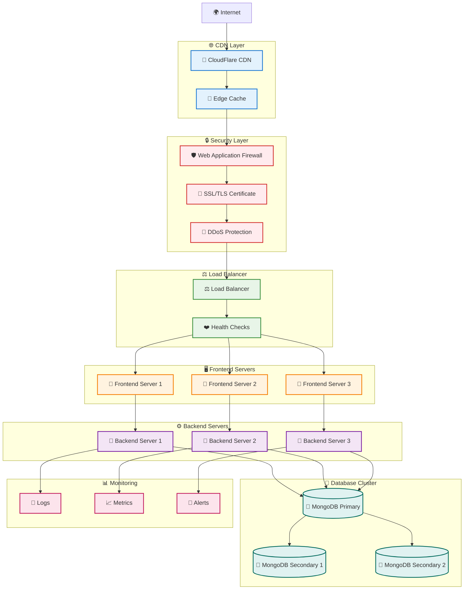
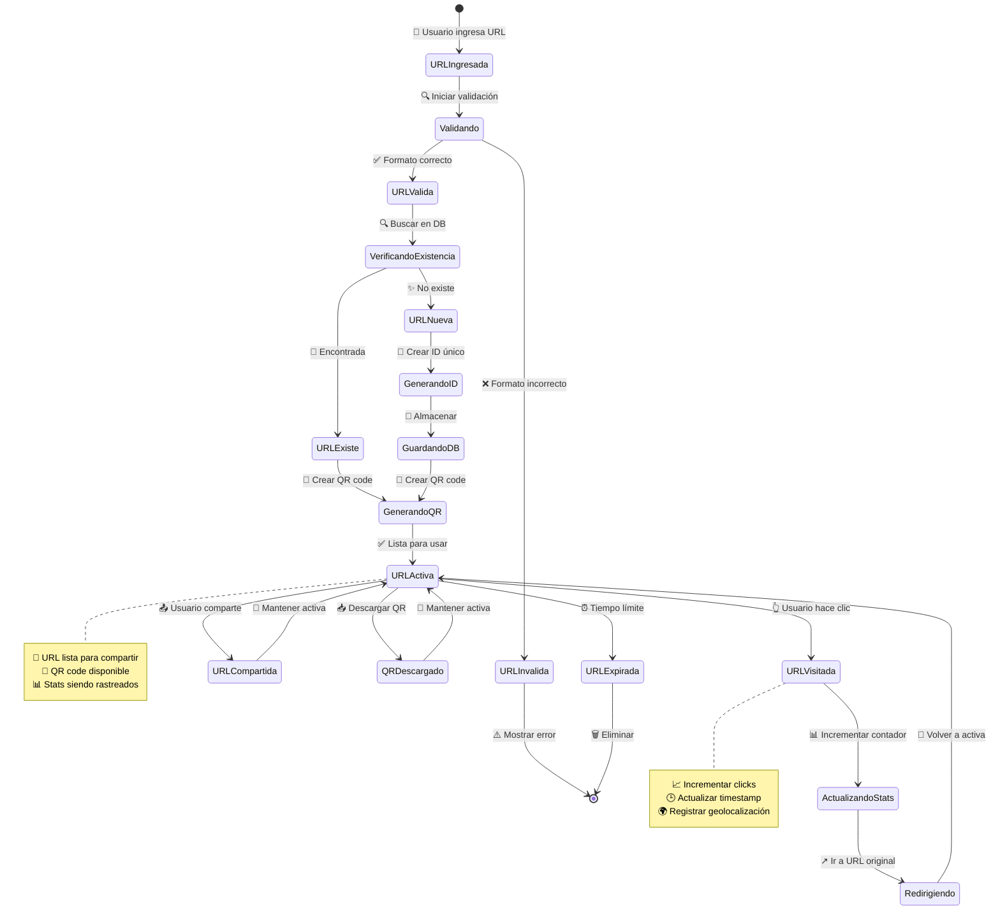
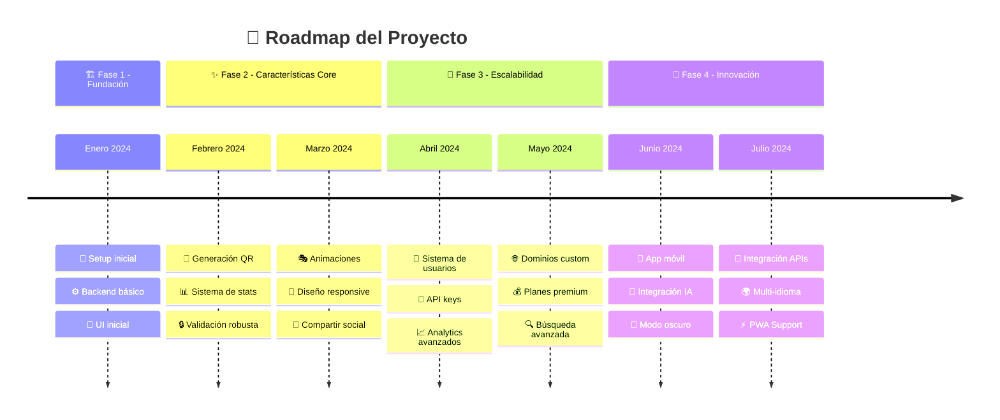
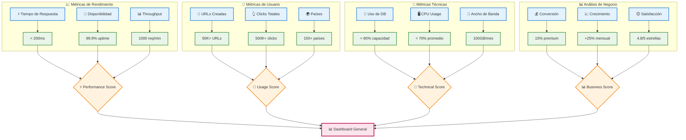

# Short-URL
# 🔗 Acortador de URLs con Código QR - Documentación Visual

<div align="center">


**Servicio moderno de acortamiento con arquitectura visual**

[](https://nodejs.org/)
[](https://reactjs.org/)
[](https://mongodb.com/)

</div>

---

## 🌐 Mapa Conceptual del Sistema



---

## 🏗️ Arquitectura de Conexiones del Sistema



---

## 🔄 Flujo de Datos y Procesos



---

## 🎯 Mapa de Funcionalidades



---

## 🛠️ Stack Tecnológico - Diagrama de Dependencias



---

## 📊 Flujo de Datos - Diagrama Entidad-Relación



---

## 🚀 Proceso de Despliegue - Pipeline Visual

```mermaid
gitgraph
    commit id: "📝 Código inicial"
    commit id: "🔧 Setup backend"
    commit id: "🎨 UI components"
    
    branch develop
    checkout develop
    commit id: "✨ Nuevas features"
    commit id: "🧪 Tests añadidos"
    commit id: "📊 Analytics"
    
    branch feature/qr-enhancement
    checkout feature/qr-enhancement
    commit id: "📱 QR mejorado"
    commit id: "🎨 UI polish"
    
    checkout develop
    merge feature/qr-enhancement
    commit id: "🔀 Merge QR features"
    
    checkout main
    merge develop
    commit id: "🚀 Release v1.0"
    commit id: "🏗️ Deploy to prod"
    
    branch hotfix/security
    checkout hotfix/security
    commit id: "🔒 Security patch"
    
    checkout main
    merge hotfix/security
    commit id: "🛡️ Security update"
```

---

## 🌍 Arquitectura de Despliegue



---

## 🔄 Ciclo de Vida de una URL



---

## 🎯 Roadmap Visual - Línea de Tiempo



---

## 🔧 Guía de Instalación Visual

```mermaid
flowchart TD
    A[📋 Prerrequisitos] --> B{🔍 ¿Node.js instalado?}
    B -->|❌ No| C[📥 Descargar Node.js]
    B -->|✅ Sí| D[📦 Clonar repositorio]
    C --> D
    
    D --> E[📂 Navegar a carpeta]
    E --> F[⚙️ Instalar dependencias backend]
    F --> G[📁 Ir a carpeta frontend]
    G --> H[⚙️ Instalar dependencias frontend]
    
    H --> I[📝 Crear archivo .env]
    I --> J{🍃 ¿MongoDB listo?}
    J -->|❌ No| K[🔧 Configurar MongoDB]
    J -->|✅ Sí| L[🚀 Iniciar backend]
    K --> L
    
    L --> M[🎨 Iniciar frontend]
    M --> N[🌐 Abrir navegador]
    N --> O[🎉 ¡Aplicación funcionando!]
    
    %% Comandos específicos
    F -.-> F1[npm install]
    H -.-> H1[cd frontend && npm install]
    I -.-> I1[cp .env.example .env]
    L -.-> L1[npm run dev]
    M -.-> M1[cd frontend && npm start]
    
    %% Estilos
    classDef start fill:#e8f5e8,stroke:#388e3c,stroke-width:2px
    classDef process fill:#e3f2fd,stroke:#1976d2,stroke-width:2px
    classDef decision fill:#fff3e0,stroke:#f57c00,stroke-width:2px
    classDef end fill:#e1f5fe,stroke:#0277bd,stroke-width:2px
    classDef command fill:#f3e5f5,stroke:#7b1fa2,stroke-width:1px,stroke-dasharray: 5 5
    
    class A start
    class C,D,E,F,G,H,I,K,L,M,N process
    class B,J decision
    class O end
    class F1,H1,I1,L1,M1 command
```

---

## 📊 Métricas y Análisis - Dashboard Visual



---

<div align="center">

## 🎯 Conclusión

Esta documentación visual representa la estructura completa del **Acortador de URLs con QR**. Cada diagrama muestra las conexiones y relaciones entre los diferentes componentes del sistema, facilitando la comprensión tanto para desarrolladores como para stakeholders.

### 📋 Elementos Visuales Incluidos:
- 🧠 **Mapas Conceptuales** - Visión general del sistema
- 🔄 **Diagramas de Flujo** - Procesos paso a paso  
- 🏗️ **Arquitectura de Conexiones** - Estructura técnica
- 📊 **Modelos de Datos** - Relaciones entre entidades
- 🚀 **Pipeline de Despliegue** - Proceso de desarrollo
- 📈 **Métricas Visuales** - KPIs y análisis

**¡Explora cada diagrama para entender mejor el sistema!**

---

**Hecho con ❤️ usando Mermaid Diagrams**

</div>
